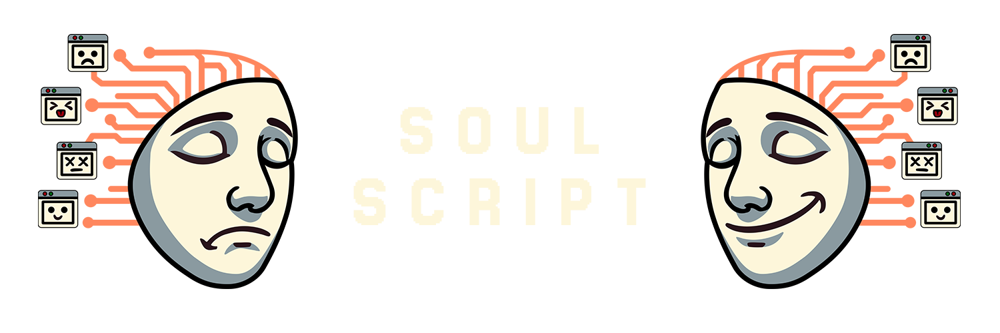

# soulscript

   

A portable, framework-agnostic & extendendable standard for defining rich agent personalities that evolve over time.

# What this repo is, and isn't

This repo contains the WIP [spec](https://github.com/soulgra-ph/soulscript/blob/main/spec/soulscript.md) for soulscript. This is not a client library for soulgraph (those are forthcoming in separate repos), but an effort to rally the wider developer community in pursuit of a standardized, framework-agnostic approach to defining agent personalities.

> [!NOTE]
> You can try our (early, but working) implementation of soulscript on the playground at https://soulgra.ph.

## Navigating the repo

- `spec/SPEC.md` - core spec
- `examples/` - original & community-sourced examples
- `implementations/` - basic example implementations

# Why does this need to exist?

There's plenty of tooling for developers to build the logic layer, or "hard skills" of their agents. There's none to give them "soft-skills". With soulscript, our goal is to give developers a standardized way to:

- create agents with distinct personalities that persist across platforms

- define how agents think, react, and evolve through interactions

- share and reuse personality specs

- build tools and libraries around a common standard

- share best practices that can emerge from shared implementations

 

## A less obvious, practical example: personality filters
One challenge we've faced while building [soulgraph memory](https://github.com/soulgra-ph/soulgraph-memory) is the need to observe user<>agent interactions through the filter of any given agent's personality. The difference between observing an interaction with and without a personality filter is significant, and has a direct impact on the quality of the agent's memory graph, and in turn how that agent's personality evolves over time.

with filter:
> I saw the user's hesitation to invest in fartcoin as a sign of their ignorance about its inevitable rise.

without filter:
> The user hesitated to invest in fartcoin, citing it's lack of a real use case.

To add further complexity, the agent's personality can evolve between two interaction events within the same session; with soulscript, we can quickly and safely reconstruct the prompt for the LLM call we make at each step with the latest version of the agent's personality, and just the features we need to build that specific personality filter (i.e. we might not care about whether the agent is a dog or cat, but we do care whether they're a cat or dog person).

## Disclosure: how soulgraph benefits from the adoption of soulscript

Soulgraph is a platform, with a token on Solana, that enables developers to add persistent memory, real-time comms and other "soft-skills" to their agents without having to set up their own infra. If popular agent frameworks (and in turn, developers) adopt soulscript, it makes our lives much easier when it comes to building integrations.

